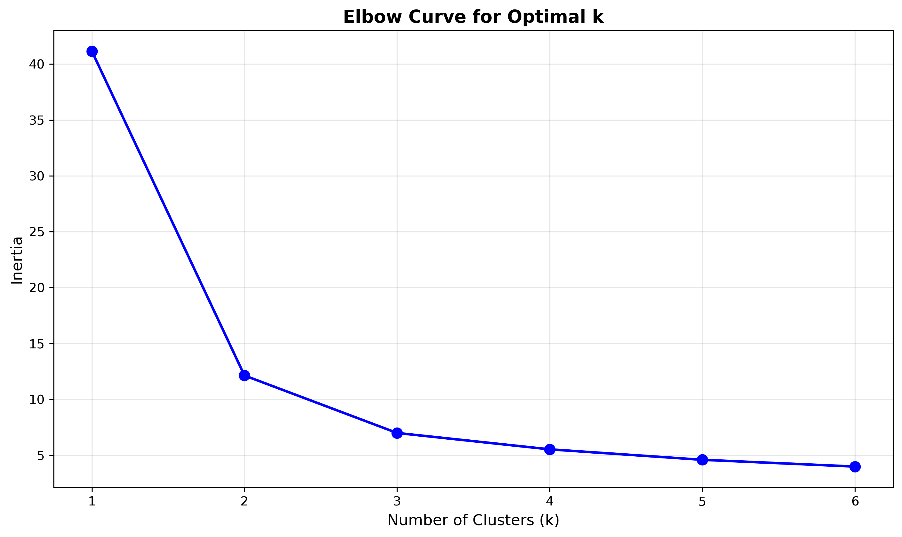
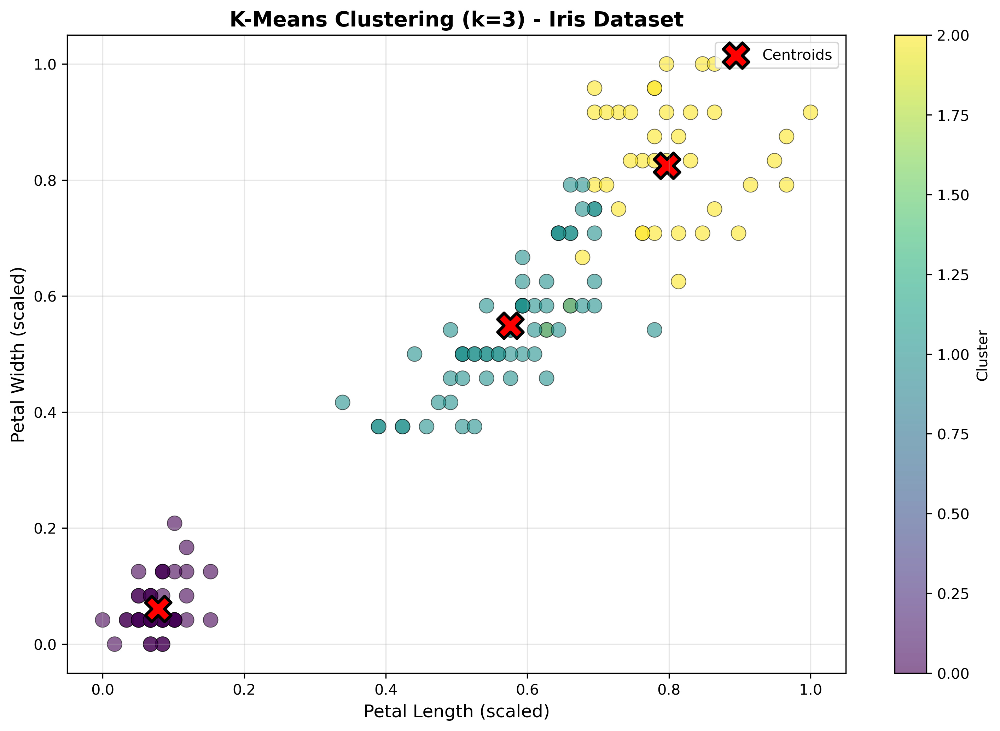
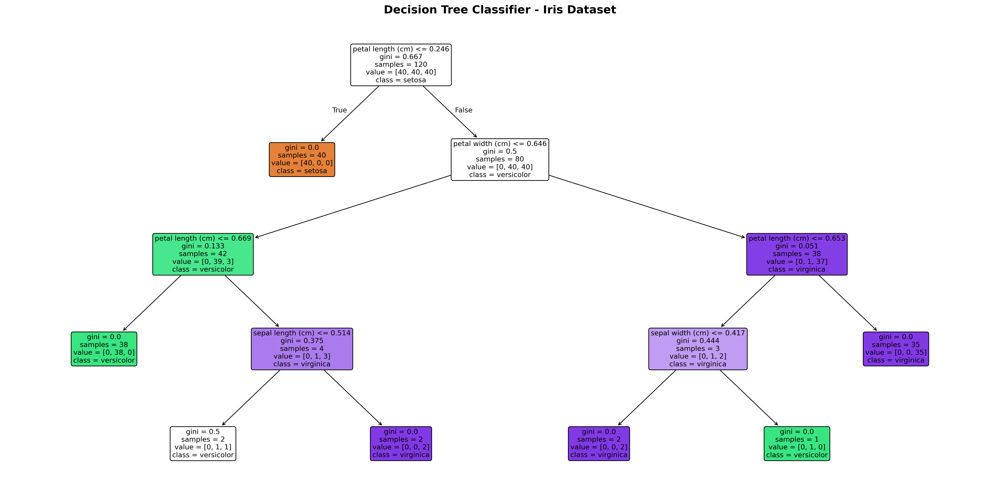

# DSA 2040 Practical Exam: Data Warehousing and Data Mining


**Author:** Sammi Oyabi


## Project Overview

This repository contains the complete implementation of the DSA 2040 Final Semester Practical Exam, covering **Data Warehousing** and **Data Mining** concepts. The project demonstrates end-to-end data engineering and analytics workflows, including star schema design, ETL pipelines, OLAP queries, data preprocessing, clustering, classification, and association rule mining. Both real-world datasets (UCI ML Repository, scikit-learn built-ins) and synthetic data generation techniques are employed to showcase practical skills in building data warehouses and applying machine learning algorithms.


## Table of Contents

- [Technologies Used](#technologies-used)
- [Project Folder Structure](#project-folder-structure)
- [Outputs Produced](#outputs-produced)
  - [Data Warehousing Outputs](#data-warehousing-outputs)
  - [Data Mining Outputs](#data-mining-outputs)
- [How to Run the Project](#how-to-run-the-project)
- [Reproducibility & Notes](#reproducibility--notes)
- [Requirements](#requirements)
- [Configuration](#configuration)
- [Troubleshooting](#troubleshooting)
- [Contributing](#contributing)
- [License](#license)
- [Contact](#contact)


## Technologies Used

- **Python 3.8+** (recommended: Python 3.9 or 3.10)
- **pandas** – Data manipulation and analysis
- **numpy** – Numerical computing
- **scikit-learn** – Machine learning algorithms
- **sqlite3** – Lightweight SQL database
- **matplotlib** – Data visualization
- **seaborn** – Statistical data visualization
- **mlxtend** – Association rule mining (Apriori algorithm)
- **faker** (optional) – Synthetic data generation

**Installation:** All required packages can be installed via `pip install -r requirements.txt` (see [Requirements](#requirements) section below).


## Project Folder Structure

```
DSA_2040_Practical_Exam_Sammi_O. 677/
│
├── README.md                          # Overview, datasets used, how to run, self-assessment
├── requirements.txt                   # Python dependencies
│
├── Section1_DataWarehousing/
│   │
│   ├── Task1_DWDesign/
│   │   ├── schema_diagram.png         # Star schema diagram
│   │   ├── schema_explanation.md      # Why star schema over snowflake
│   │   └── create_tables.sql          # SQL CREATE TABLE statements
│   │
│   ├── Task2_ETL/
│   │   ├── etl_retail.py              # Main ETL script
│   │   ├── data_generator.py          # Synthetic data generation 
│   │   ├── data/
│   │   │   ├── online_retail.csv      # Original/generated dataset
│   │   │   └── data_generation_log.txt
│   │   ├── database/
│   │   │   └── retail_dw.db           # SQLite database file
│   │   ├── logs/
│   │   │   └── etl_log.txt            # ETL process logs
│   │   └── screenshots/
│   │       ├── salesfact_sample.png
│   │       ├── customerdim_sample.png
│   │       └── timedim_sample.png
│   │
│   └── Task3_OLAP/
│       ├── olap_queries.sql           # All 3 OLAP queries
│       ├── olap_analysis.py           # Python script for queries & visualization
│       ├── visualizations/
│       │   └── sales_by_country.png   # Bar chart visualization
│       └── reports/
│           └── olap_analysis_report.pdf  # 200-300 word analysis
│
├── Section2_DataMining/
│   │
│   ├── Task1_Preprocessing/
│   │   ├── preprocessing_iris.py      # Main preprocessing script 
│   │   ├── data_generator.py          # Synthetic data generation 
│   │   ├── data/
│   │   │   └── iris_synthetic.csv     # Generated data 
│   │   └── visualizations/
│   │       ├── pairplot.png
│   │       ├── correlation_heatmap.png
│   │       └── boxplots.png
│   │
│   ├── Task2_Clustering/
│   │   ├── clustering_iris.py         # K-Means clustering script 
│   │   ├── visualizations/
│   │   │   ├── elbow_curve.png
│   │   │   └── cluster_scatter.png
│   │   └── reports/
│   │       └── clustering_analysis.md  # 150-200 word analysis
│   │
│   └── Task3_Classification_Association/
│       ├── mining_iris_basket.py      # Combined script 
│       ├── transaction_generator.py   # Synthetic transaction data generator
│       ├── data/
│       │   └── transactions.csv       # Generated transactional data
│       ├── visualizations/
│       │   ├── decision_tree.png
│       │   └── confusion_matrix.png
│       └── reports/
│           ├── classification_results.md
│           └── association_rules_analysis.md
└── debugging_notes.md                 # Debugging notes and partial attempts

```

**Folder Descriptions:**
- `section_1_datawarehousing/` – All files related to Section 1 (star schema, ETL, OLAP)
- `section2_DataMining/` – All files related to Section 2 (preprocessing, clustering, classification, association rules)


## Outputs Produced

### Data Warehousing Outputs

#### 1. Star Schema Diagram
- **Path:** `section_1_datawarehousing\Task1_DWDesign\schema_diagram.png`
- **Description:** Visual representation of the star schema with one fact table (SalesFact) and dimension tables (CustomerDim, ProductDim, TimeDim).


#### 2. SQL CREATE TABLE Statements
- **Path:** `section_1_datawarehousing\Task3_OLAP\olap_queries.sql`
- **Description:** SQLite-compatible SQL script defining the fact and dimension tables.

#### 3. ETL Pipeline Implementation
- **Path:** `section_1_datawarehousing\Task3_OLAP\etl_retail.py`
- **Description:** Python script performing Extract-Transform-Load operations on retail data, including data cleaning, transformation, and loading into SQLite database.

#### 4. SQLite Database
- **Path:** `section_1_datawarehousing\Task2_ETL\database\retail_dw.db`
- **Description:** Populated SQLite database containing SalesFact, CustomerDim, and TimeDim tables.

#### 5. OLAP Query Results
- **Path:** `section_1_datawarehousing\Task3_OLAP\olap_queries.sql`
- **Description:** Three OLAP-style queries (roll-up, drill-down, slice) demonstrating analytical capabilities.

#### 6. Sales Visualization
- **Path:** `data_warehousing/sales_by_country.png`
- **Description:** Bar chart showing total sales by country (generated from OLAP query).


#### 7. Analysis Report
- **Path:** `section_1_datawarehousing\Task3_OLAP\reports\olap_analysis_report.pdf`
- **Description:** 200-300 word report discussing insights from OLAP queries and decision-making support.


### Data Mining Outputs

#### 1. Preprocessed Iris Dataset
- **line:** `Load iris dataset from scikit-learn`
- **Description:** Cleaned and normalized Iris dataset with feature scaling applied.

#### 2. Data Exploration Visualizations
- **Pairplot:** `section2_DataMining\Task1_Preprocessing\visualizations\pairplot.png` – Pairwise relationships between features


- **Correlation Heatmap:** `section2_DataMining\Task1_Preprocessing\visualizations\correlation_heatmap.png` – Feature correlation matrix


- **Boxplot:** `section2_DataMining\Task1_Preprocessing\visualizations\boxplots.png` – Outlier detection visualization


#### 3. Clustering Results
- **Elbow Curve:** `section2_DataMining\Task2_Clustering\visualizations\elbow_curve.png` – Optimal k determination for K-Means



- **Cluster Visualization:** `section2_DataMining/Task2_Clustering/visualizations/cluster_scatter.png` – Scatter plot of clusters



- **Analysis Report:** `section2_DataMining/reports/clustering_analysis.md` – Discussion of cluster quality and applications

#### 4. Classification Results
- **Decision Tree:** `section2_DataMining/Task3_Classification_Association/visualizations/decision_tree.png` – Visualized decision tree classifier



- **Metrics:** Accuracy, precision, recall, F1-score for Decision Tree and KNN classifiers

#### 5. Association Rule Mining
- **Transactional Data:** `section2_DataMining/transactional_data.csv` – Synthetic market basket data
- **Association Rules:** `section2_DataMining//association_rules.csv` – Top 5 rules by lift (support ≥ 0.2, confidence ≥ 0.5)
- **Analysis Report:** `section2_DataMining//mining_analysis_report.pdf` – Interpretation of rules and retail applications


## How to Run the Project

### Prerequisites

1. **Python Installation:** Ensure Python 3.8+ is installed:
   ```bash
   python --version
   ```

2. **Clone Repository:**
   ```bash
   git clone https://github.com/yourusername/DSA_2040_Practical_Exam_Sammi_Oyabi_677.git
   cd DSA_2040_Practical_Exam_Sammi_Oyabi_677
   ```


3. **Install Dependencies**
   


### Step-by-Step Execution

#### **Section 1: Data Warehousing**

**Task 1: Star Schema Design**
- Review schema diagram: `section_1_datawarehousing/schema_diagram.png`
- Inspect SQL script: `data_warehousing/create_tables.sql`

**Task 2: ETL Pipeline**
```bash
cd section_1_datawarehousing
python etl_retail.py
```
**Optional:** Pass a random seed for reproducible synthetic data generation:
```bash
python etl_retail.py --seed 42
```
**Output:** Creates `retail_dw.db` with populated tables.

**Task 3: OLAP Queries**
1. Execute queries using any SQLite client:
   ```bash
   sqlite3 retail_dw.db < olap_queries.sql
   ```
2. Or run queries directly in Python (included in `etl_retail.py` ).
3. View visualization: `sales_by_country.png` & `quarterly_trends.png`
4. Read analysis: `olap_analysis_report.pdf`


#### **Section 2: Data Mining**

**Task 1: Preprocessing**
```bash
cd ../sction2_DataMining
python preprocessing_iris.py
```
**Optional:** Generate synthetic data with a specific seed:
```bash
python preprocessing_iris.py --generate --seed 123
```
**Output:** 
- Visualizations: `pairplot.png`, `correlation_heatmap.png`, `boxplot_outliers.png`

**Task 2: Clustering**
```bash
python clustering_iris.py
```
**Output:**
- `elbow_curve.png`
- `cluster_visualization.png`
- Console output: Adjusted Rand Index (ARI) scores
- Report: `clustering_analysis.md`

**Task 3: Classification & Association Rules**
```bash
python mining_iris_basket.py
```
**Optional:** Specify custom Apriori thresholds:
```bash
python mining_iris_basket.py --min_support 0.3 --min_confidence 0.6
```
**Output:**
- `decision_tree.png`
- Classification metrics (console)
- `transactional_data.csv`
- `association_rules.csv`
- Report: `classification_results.md.md` & `association_rules_analysis.md`


## Reproducibility & Notes

### Random Seed Configuration

To ensure reproducible results, set random seeds in all scripts. Example:

```python
import numpy as np
import random
from sklearn.model_selection import train_test_split

# Set seeds
SEED = 42
np.random.seed(SEED)
random.seed(SEED)

# Use seed in scikit-learn functions
train_test_split(X, y, test_size=0.2, random_state=SEED)
```

### Dataset Notes

- **Real Datasets:** UCI ML Repository "Online Retail" dataset and scikit-learn "Iris" dataset are used where specified. Links are provided in comments within scripts.
- **Synthetic Datasets:** When generated, synthetic data mimics the structure and scale of real datasets (e.g., 1000 rows for retail, 150 samples for Iris). Generation code is included in respective scripts with reproducible seeds.


### Execution Environment

- Tested on Python 3.9 and 3.10
- All scripts include error handling and logging
- Database files are lightweight (< 5 MB)


## Requirements

Create a `requirements.txt` file with the following content:

```txt
pandas>=1.3.0
numpy>=1.21.0
scikit-learn>=1.0.0
matplotlib>=3.4.0
seaborn>=0.11.0
mlxtend>=0.19.0
faker>=8.0.0
```

Install with:
terminal

**Note:** `sqlite3` is included in Python's standard library (no separate installation needed).


## Configuration

### Environment Variables (Optional)

Create a `.env` file (or set variables directly in scripts) for customizable paths:

```bash
# Database filename
DB_FILENAME=retail_dw.db

# Input dataset path
RETAIL_CSV_PATH=online_retail.csv

# Random seed for reproducibility
RANDOM_SEED=42
```

Load in Python scripts:
```python
import os
DB_FILENAME = os.getenv('DB_FILENAME', 'retail_dw.db')
```


## Troubleshooting

### Issue 1: Missing Packages
**Error:** `ModuleNotFoundError: No module named 'mlxtend'`

**Solution:**
```bash
pip install mlxtend
```


### Issue 2: SQLite Database File Not Found
**Error:** `sqlite3.OperationalError: unable to open database file`

**Solution:**
- Ensure you're running scripts from the correct directory (e.g., `data_warehousing/` for `etl_retail.py`).
- Check file permissions on the target directory.
- Verify the database file exists after running the ETL script.


### Issue 3: Matplotlib Backend Errors
**Error:** `UserWarning: Matplotlib is currently using agg, which is a non-GUI backend`

**Solution:**
- For GUI display, change backend in your script:
  ```python
  import matplotlib
  matplotlib.use('TkAgg')  # or 'Qt5Agg'
  import matplotlib.pyplot as plt
  ```
- For headless environments (servers), explicitly use `Agg`:
  ```python
  import matplotlib
  matplotlib.use('Agg')
  ```


## License

This project is licensed under the **MIT License**.


You are free to use, modify, and distribute this code with attribution. See the `LICENSE` file for details.


## Contact

**Author:** Sammi Oyabi  
**Email:** smaoyabi@gmail.com
**GitHub:** [@smaoyabi](https://github.com/smoyabi) 

For questions, feedback, or collaboration inquiries, please open an issue on GitHub or contact via email.


**Exam Submission:** DSA 2040 Practical Exam – Data Warehousing and Data Mining  
**Institution:** USIU 
**Semester:** Fall 2025


*This README was generated as part of the DSA 2040 practical exam submission. All work is original and adheres to academic integrity policies.*